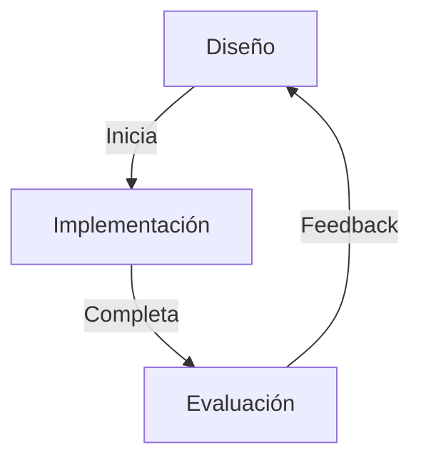

[[Interfaces Persoa Máquina]]

## Interfaces de usuario
Una interfaz de usuario es el mecanismo mediante el cual un usuario de un sistema interactúa con este. Debe permitir la entrada de información por parte del usuario y abastecerle con la salida pertinente. No aplica solo para la informática, cualquier dispositivo de entrada/salida necesita una interfaz.

### Importancia de las UI
El interfaz de usuario es muy importante. Afecta de manera decisiva en la percepción de un software:
+ Mejora las ventas.
+ Aumenta la vida de un proyecto.

La percepción de un usuario sobre un diseño o una interfaz puede ser inicialmente positiva debido a factores superficiales, como la estética o el atractivo visual, incluso si hay problemas subyacentes en el diseño.

### Problemas de una mala UI
+ El tiempo de los usuarios es indispensable. Las personas quieren resultados lo antes posible.
+ Los errores de diseño pueden ser muy caros: mantenimiento, atención al cliente...
+ Existen sistemas informáticos que son esenciales para operaciones críticas y sensibles, donde el correcto funcionamiento del sistema tiene un impacto significativo en la seguridad, la salud o la integridad del proceso o actividad que están respaldando.

### Dificultades
Muchas veces las personas no son directamente los usuarios de un software. Un proceso suele comunicarse con otro a través de una interfaz. En cambio, cuando se diseña una interfaz de usuario, no se hace de forma técnica, sino que se siguen los requisitos de clientes reales.

Muchas veces esto es un problema. Los usuarios a veces no saben lo que quieren y puede haber errores de diseño.

Las interfaces de usuario ocupan mucho tiempo de desarrollo. Suelen ocupar la mitad de tiempo de diseño, implementación, mantenimiento y tamaño del código.

### Usabilidad
La usabilidad es lo bien o mal que los usuarios son capaces de utilizar las funcionalidades de un sistema. Se basa en:
+ aprendizaje
+ eficiencia
+ recuerdo
+ cantidad de errores
+ satisfacción

La usabilidad depende del tipo de usuario. Un usuario novato necesita una IU con muy buena tasa de aprendizaje, un usuario poco frecuente necesita una buena tasa de recuerdo y un usuario experto necesita eficiencia. Aunque ningún usuario es totalmente novato o experto.

En el desarrollo de software, las dimensiones se refieren a diferentes aspectos o características que se pueden evaluar en un sistema. Estas dimensiones abarcan diversos aspectos que son esenciales para el éxito y la eficacia del software. Entre estas dimensiones se incluyen funcionalidad, rendimiento, coste, seguridad, usabilidad, fiabilidad, entre otras.

Muchas decisiones de diseño en el desarrollo de software implican un compromiso entre estas diversas dimensiones. Esto significa que, en la práctica, no siempre es posible maximizar todas las dimensiones simultáneamente. Por ejemplo, un aumento en la seguridad del software podría implicar una complejidad adicional, lo que podría afectar negativamente la usabilidad. Del mismo modo, optimizar el rendimiento podría requerir compromisos en términos de coste.

## Desarrollo de interfaces
Es un proceso continuo y interativo:

Las fases son:
+ **Análisis:** Captura de información sobre el dominio, el entorno, los usuarios, etc. Se usan técnicas como entrevistas o observaciones del entorno de trabajo. Una vez recogida la información se define el problema.
+ **Diseño:** Se utilizan diferentes patrones dependiendo si hay IU o no. Se elige la plataforma, estructura y se elaboran los mockups y prototipos. La lógica de presentación, de negocio y de servicio debe estar en iteraciones diferentes. Se usan técnicas como el diseño colaborativo, prototipos, etc.
+ **Implementación:** Construcción/codificación de un entregable.
+ **Pruebas:** Se comprueban la funcionalidad, la usabilidad, la seguridad y se somete a pruebas de estrés. Es importante recordar que las pruebas varian entre fases alpha y beta.

### Modelo en cascada
El modelo en cascada tradicional también puede hacerse con feedback. Sin embargo, no es adecuado para el diseño de IU:
+ El diseño de IU es arriesgado y poco predecible.
+ El usuario no interviene hasta la fase de aceptación.
+ Una flaqueza puede generar un gran cambio.

### Modelos iterativos
El modelo iterativo no es más que un modelo en cascada dividido en bloques. El usuario interviene en la fase final de cada iteración. 

Un ejemplo es el ciclo en espiral. Los errores serían más baratos de detectar en una etapa inicial (prototipado). Las primeras fases son prototipos simples y baratos y cuanto más se avanza más completas son las iteraciones e implementaciones. Al final de cada iteración el usuario evalúa el proyecto.

