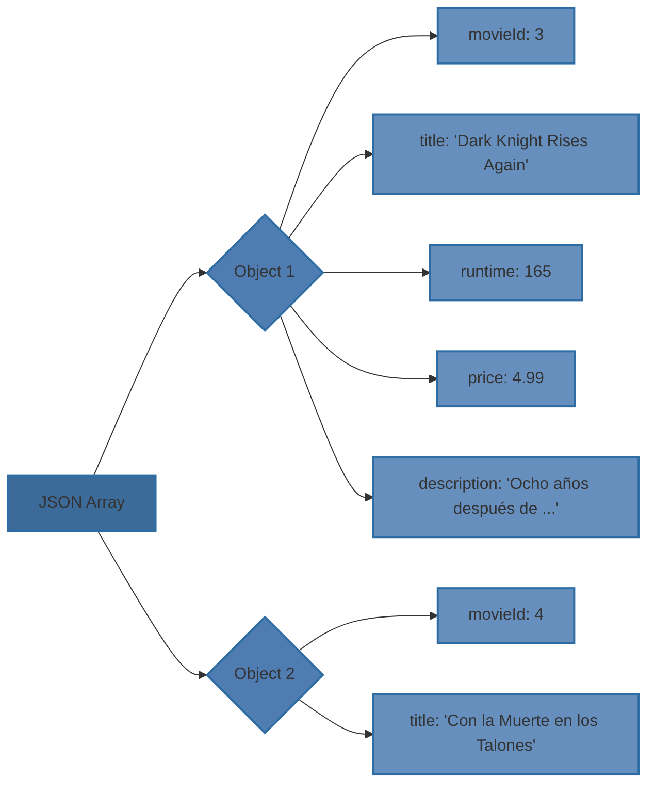

[[Tema 5-Lenguajes de intercambio de datos XML y JSON]]

## Introducción
Al igual que en XML, los JSON se apoyan 2 ideas:
+ Tienen que estar bien formados
+ Opcionalmente el documento puede estar descrito en un esquema JSON que lo valide

Por ello es posible construir parsers genéricos que comprueben que el documento esté bien formado y validadores.

## Tipos de parsers
+ **Modelo de árbol o de objetos:** Son similares a los tipo DOM de XML. Construyen un árbol en memoria equivalente al documento JSON.
+ **Streaming:** Son similares a los tipo streaming de XML. Procesan secuencialmente el código en bloques.

## Parsers y validadores en Java
El API estándar para parsear, transformar, generar y consultar documentos JSON es JSON-P. Sin embargo existen mejores alternativas, como Jackson.

Al contrario que con los parsers, no existe un estándar para los validadores en Java. Existen algunas librerías que implementan validadores:
+ JSON Schema Validator
+ everit.org/json.schema
+ Justify

### Jackson
El módulo Jackson contiene:
+ Clases que modelan los distintos tipos de nodo del árbol Jackson
+ Clases que permiten construir el árbol Jackson a partir de un JSON
+ Clases que permiten construir un JSON a partir de un árbol Jackson
+ Paquete com.fasterxml.jackson.databind
![[com.fasterxml.jackson.databind.png]]
Los métodos xxxValue no lanzan excepciones, devuelven null, false, 0...

Por ejemplo, la representación de este JSON:
```
[
  {
    "movieId": 3,
    "title": "Dark Knight Rises Again",
    "runtime": 165,
    "price": 4.99,
    "description": "Ocho años después de ... "
  },
  {
    "movieId": 4,
    "title": "Con la Muerte en los Talones",
    "runtime": 136,
    "price": 3.99,
    "description": "Roger O. Thornhill (Cary Grant) es un ... "
  }
]
```



Para transformar un JSON en un árbol Jackson se usan ObjectMapper, ObjetcWritter y JsonNodeFactory. En Movies utilizamos las siguientes clases:
+ **toObjectNode:** recibe un RestMovieDto y genera un árbol Jackson.
+ **toArrayNode:** recibe una lista de RestMovieDto y genera un árbol Jackson.
+ **toRestMovieDto:** recibe un JSON u crea un RestMovieDto.

```
public static ObjectNode toObjectNode(RestMovieDto movie) {  
  
    ObjectNode movieObject = JsonNodeFactory.instance.objectNode();  
    movieObject.put("movieId", movie.getMovieId()).  
          put("title", movie.getTitle()).  
          put("runtime", movie.getRuntime()).  
          put("price", movie.getPrice()).  
          put("description", movie.getDescription());  
    return movieObject;  
}  
  
public static ArrayNode toArrayNode(List<RestMovieDto> movies) {  
    ArrayNode moviesNode = JsonNodeFactory.instance.arrayNode();  
    for (int i = 0; i < movies.size(); i++) {  
       RestMovieDto movieDto = movies.get(i);  
       ObjectNode movieObject = toObjectNode(movieDto);  
       moviesNode.add(movieObject);  
    }  
    return moviesNode;  
}  
  
public static RestMovieDto toRestMovieDto(InputStream jsonMovie) throws ParsingException {  
    try {  
       ObjectMapper objectMapper = ObjectMapperFactory.instance();  
       JsonNode rootNode = objectMapper.readTree(jsonMovie);  
       if (rootNode.getNodeType() != JsonNodeType.OBJECT) {  
          throw new ParsingException("Unrecognized JSON (object expected)");  
       } else {  
          ObjectNode movieObject = (ObjectNode) rootNode;  
          JsonNode movieIdNode = movieObject.get("movieId");  
          Long movieId = (movieIdNode != null) ? movieIdNode.longValue() : null;  
          String title = movieObject.get("title").textValue().trim();  
          String description = movieObject.get("description").textValue().trim();  
          short runtime =  movieObject.get("runtime").shortValue();  
          float price = movieObject.get("price").floatValue();  
          return new RestMovieDto(movieId, title, runtime, description, price);  
       }  
    } catch (ParsingException ex) {  
       throw ex;  
    } catch (Exception e) {  
       throw new ParsingException(e);  
    }  
}
```