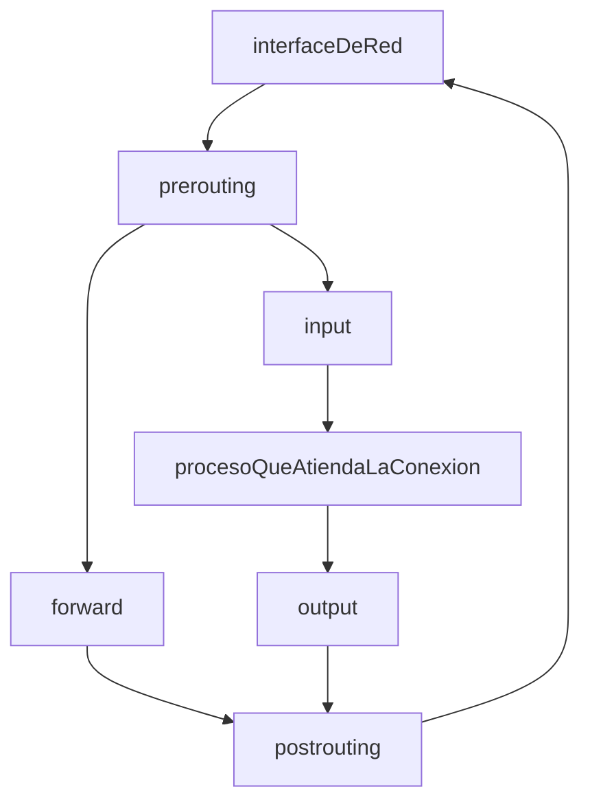

[[Tema 6-IPTABLES]]

### Iptables

+ ip6tables
+ arptables
+ ipset
+ ebtables

Reglas de tipo iput: conexiones que entran a mi máquina
Reglas de tipo output: salida
Reglas forward: conexiones que no van dirigidas a mi máquina
Reglas mangle: reglas de modificación de paquetes

### Tablas
Mangle (pre, input, forw, output, post)
NAT (pre, output, post)
Filter (input, forw, output)

### Comandos
+ iptables -t tabla comando cadena condición acción opciones
+ iptables -t filter -A input -p tcp --dport 123 -j drop # Nadie entra a mi puerto 123
+ iptables -F # firewall vacío
+ iptables -X # firewall sin cadenas
+ iptables -P input dro/output drop/forward drop # políticas
+ iptables -A input -i lo -j ACCEPT
+ iptables -A output -i lo -j ACCEPT
+ iptables -A input -s 10.11.48.cliente -d 10.11.48.miip -p tcp --dport 514 -j ACCEPT
+ iptables -A output -s 10.11.48.miip -d 10.11.48.cliente -p tcp --sport 514 -j ACCEPT
+  iptables -A input -s 10.11.48.cliente -d 10.11.48.miip -p udp --dport 123 -j ACCEPT