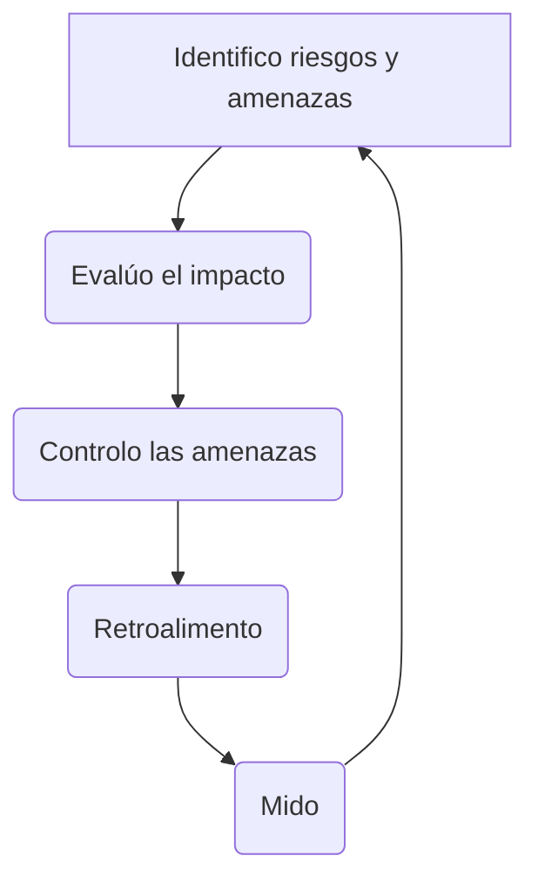

[[Tema 11-Gestión de la seguridad]]

## Riesgos
El riesgo es la incertidumbre sobre la ocurrencia de un evento que afecte el logro de los objetivos de la organización mediante el siniestro de activos. Los riesgos varían muchísimo de un CPD a otro. No es lo mismo que se caiga un día el CPD en una universidad que en Amazon. Es fundamental delimitar el alcance del SGSI desde un primer momento.

Las amenazas pueden ser:
+ Humanas
+ Operacionales
+ Sociales
+ Naturales
+ Instalaciones
+ Tecnológicas

Se busca:
+ Manual de seguridad
+ Procedimientos, por ejemplo, de backup
+ Instrucciones para las tareas
+ Registros 

Para analizar los riesgos:

### Seguridad, riesgo y coste
La seguridad absoluta no existe. Los servicios críticos son en los que más se debe invertir. Hay que buscar un punto de equilibrio entre el riesgo y la seguridad. Es muy importante no perder los datos y evitar que nos los roben. 

Hay demasiados riesgos:
+ Interrupciones
+ Exploits
+ Fraudes informáticos
+ Sistemas desactualizados
+ Port scanning
+ Muchísimos otros...