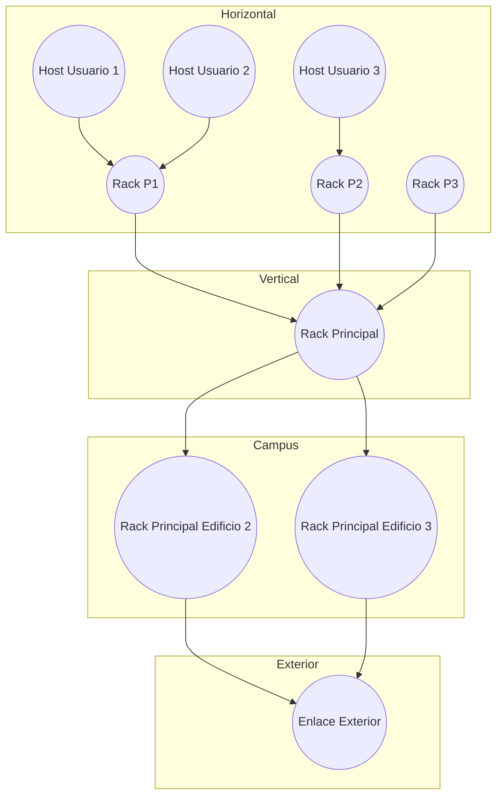

[[Tema 5-Cableado estructurado]]

## Arquitectura
Lo recomendado es hacer una topología en estrella, con un rack en cada planta y un rack central con acceso al exterior. Se divide en subsistemas:
+ **Horizontal:** desde hosts de usuario hasta un rack de planta.
+ **Vertical:** desde los racks de planta hasta el rack principal.
+ **Campus:** unión de racks principales de distintos edificios.

Un ejemplo:

