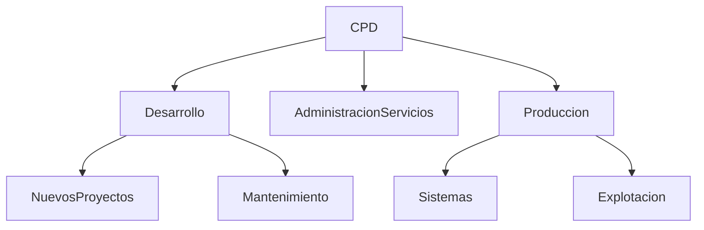

[[Tema 8-Organización de un CPD]]

## Organización
El CPD puede organizarse internamente siguiendo diferentes modelos conceptuales en función de sus características, tamaño, ubicación funcional y el tipo de tareas que realice:
+ **Organigrama funcional o departamental:** se estructura en departamentos.
+ **Organigrama por proyectos:** se estructura por proyectos.
+ **Organigrama mixto:** se estructura por departamentos, pero cuando es necesario se organiza por proyectos.

## Áreas

### Desarrollo de proyectos
El área de desarrollo de proyectos (también denominada área de análisis de sistemas y programación) se encarga de:
+ Dirección de proyectos
+ Análisis funcional
+ Análisis orgánico
+ Programación
+ Formación

### Producción
El área de producción (también denominada de explotación y mantenimiento) se encarga de:
+ Asesoramiento de nuevas adquisiciones
+ Asesoramiento del área de desarrollo
+ Instalación y mantenimiento
+ Red de comunicaciones
+ Atención a usuarios y departamentos

### Administración y servicios
El área de administración y servicios (también denominada área de organización y ventas) se encarga de:
+ Trabajo administrativo
+ Rentabilización del trabajo
+ Análisis de necesidades y búsqueda de soluciones óptimas
+ Atención al cliente posventa.

## Personal
Los puestos típicos de un CPD son:
+ Director del CPD
+ Jefes de proyecto
+ Analistas
+ Programadores
+ Técnicos de sistemas
+ Operadores
+ Jefes de explotación
+ Administradores de BBDD
+ Agentes comerciales