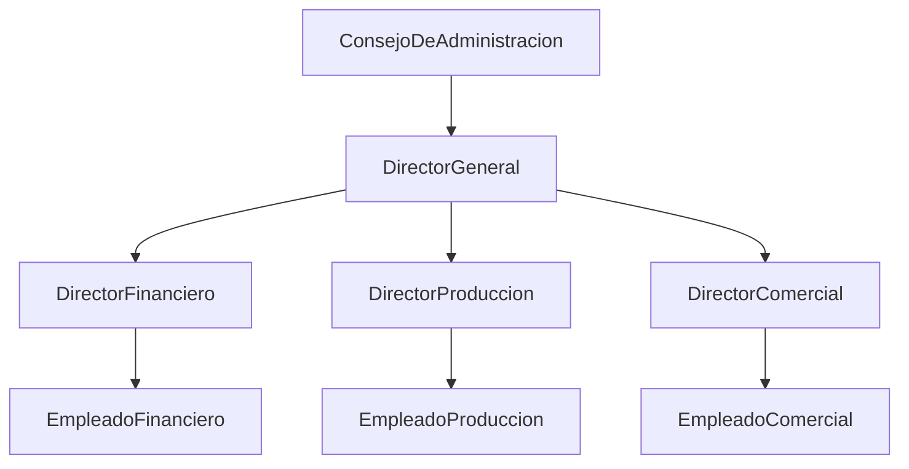
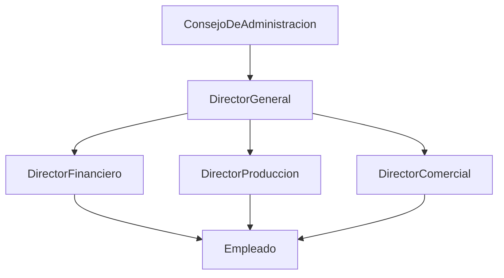

[[Tema 8-Organización de un CPD]]

### Recursos
El CPD se ubica en consonancia con el modelo organizacional de la organización.

##### Organización jerárquica o lineal

Se basa en los principios de jerarquía, autoridad y responsabilidad. 

Las ventajas de este modelo son:
+ Cada empleado tiene un solo supervisor.
+ Establece áreas de responsabilidad.
+ La comunicación y las órdenes son directas, lo que permite tomar decisiones con rapidez.
+ Es un modelo sencillo.

Los inconvenientes son:
+ Cada supervisor tiene responsabilidad sobre tareas variadas.
+ La mayor carga de trabajo se acumula en los niveles más altos.
+ Tiene carencias de personal especializado.
+ Cuando crece la organización aumenta la burocracia, entorpeciéndose la toma de decisiones.

##### Organización funcional

Se basa en el principio de división del trabajo y en la especialización del personal. Sirve para suplir las carencias de las organizaciones jerárquicas, permite ahorrar tiempo y proporciona mayor destreza en el trabajo individual. Desaparece la unidad central de mando.

Las ventajas son:
+ 

Los inconvenientes son:
+ 

##### Organización mixta
Es una mezcla entre el modelo jerárquico y el funcional. Si sitúan los especialistas entre el jefe general y el personal.

##### Modelo colegial
Se basa en comités.

##### Modelo matricial
Se basa en los ciclos de vida.