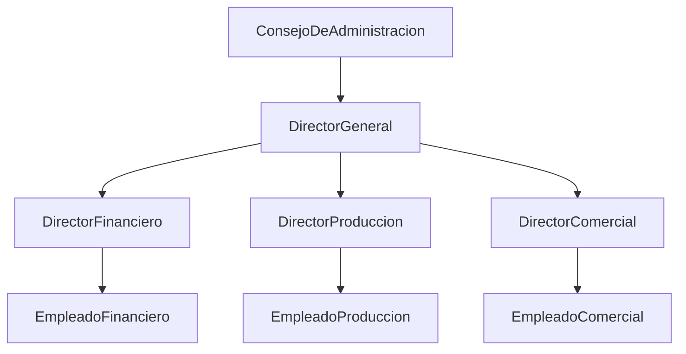
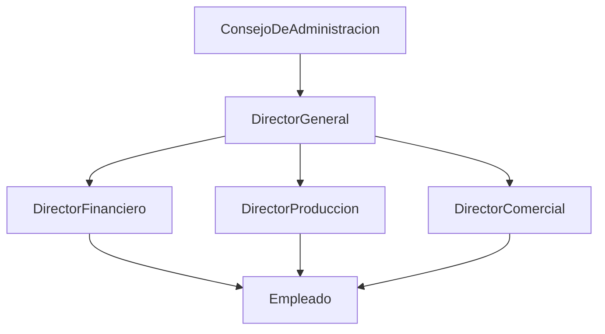
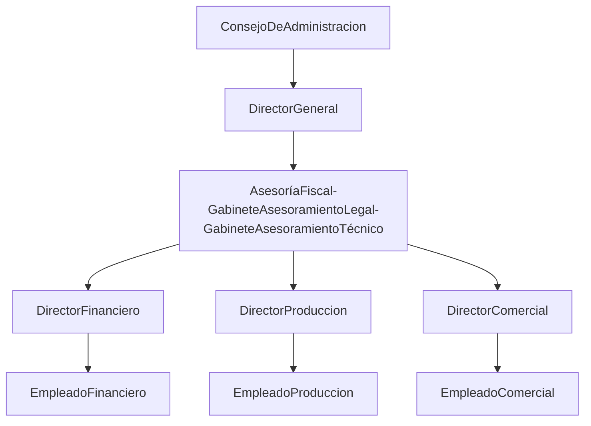
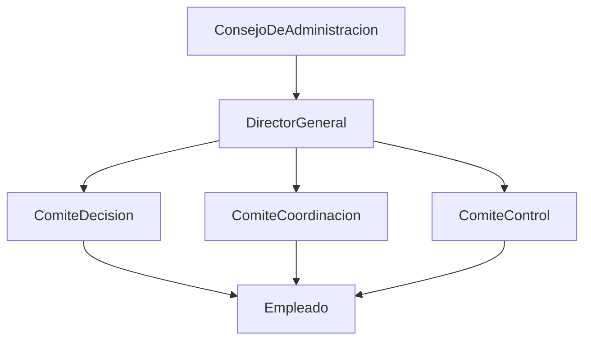
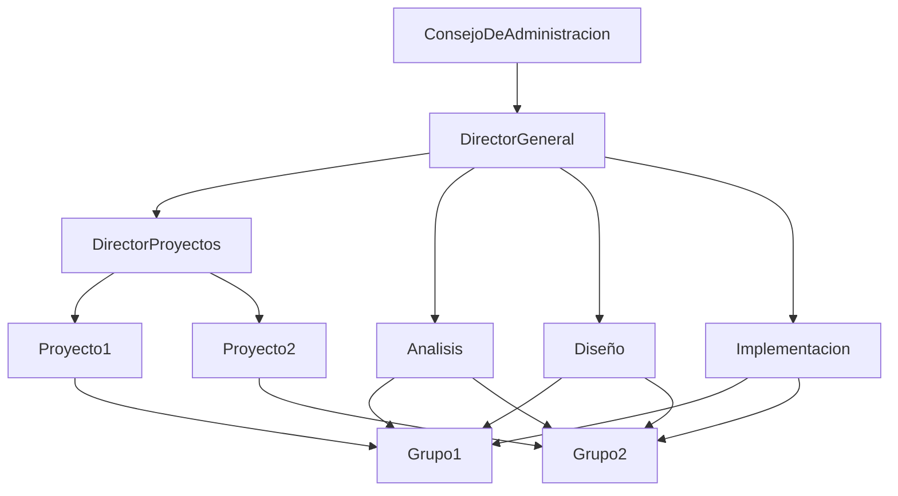

[[Tema 8-Organización de un CPD]]

## Recursos
El CPD se ubica en consonancia con el modelo organizacional de la organización.

### Organización jerárquica o lineal

Se basa en los principios de jerarquía, autoridad y responsabilidad. 

Las ventajas de este modelo son:
+ Cada empleado tiene un solo supervisor.
+ Establece áreas de responsabilidad.
+ La comunicación y las órdenes son directas, lo que permite tomar decisiones con rapidez.
+ Es un modelo sencillo.

Los inconvenientes son:
+ Cada supervisor tiene responsabilidad sobre tareas variadas.
+ La mayor carga de trabajo se acumula en los niveles más altos.
+ Tiene carencias de personal especializado.
+ Cuando crece la organización aumenta la burocracia, entorpeciéndose la toma de decisiones.

### Organización funcional

Se basa en el principio de división del trabajo y en la especialización del personal. Sirve para suplir las carencias de las organizaciones jerárquicas, permite ahorrar tiempo y proporciona mayor destreza en el trabajo individual. Desaparece la unidad central de mando.

Las ventajas son:
+ Separación en funciones, por lo que se ahorran tiempo y recursos.
+ Cada supervisor trabaja en una especialidad.
+ El asesoramiento de un experto está disponible a los demás.
+ Se utiliza en multinacionales.

Los inconvenientes son:
+ Los empleados tienen más de un supervisor, lo que puede ser confuso.
+ Puede haber conflictos entre dos ideas de diferentes supervisores.
+ Tanto desglose puede descentralizar demasiado la generalidad.
+ Puede ser difícil coordinar distintas áreas.

### Organización mixta

Combina el modelo jerárquico y el funcional. Se apoya en un conjunto de asesores o gabinetes de expertos, denominado staff, que proporcionan asesoramiento técnico en los distintos niveles sin involucrarse en las decisiones organizacionales.

Las ventajas son:
+ Fomenta la especialización funcional.
+ Mantiene la unidad de mando del modelo jerárquico.
+ El staff solo se usa si es necesario.

Los inconvenientes son:
+ La toma de decisiones es lenta.
+ El staff puede interferir en decisiones del control administrativo.
+ Es caro.

### Modelo colegial

A este modelo se le puede añadir asesoramiento también.

Surge por la necesidad del trabajo en paralelo (horizontal) y en grupos. Los comités son órganos complejos y colegiados para la toma de decisiones Pueden ser de:
+ Decisión
+ Control
+ Información
+ Coordinación
+ Asesoramiento

Las ventajas son:
+ Facilita la coordinación.
+ Facilita el proceso de toma de decisiones relacionadas con los planes de acción y los objetivos de una organización.
+ Es instructivo y forma a los empleados.

Los inconvenientes son:
+ La toma de decisiones es lenta.
+ Falta de iniciativa.
+ Dificultad para coordinar reuniones por la cantidad de integrantes de los comités.

### Modelo matricial

Se basa en los ciclos de vida. Pretende equilibrar la departamentalización y la departamentalización por producto. Se suele utilizar en empresas de ingeniería de software.

Las ventajas son:
+ Reagrupación dinámica del personal.
+ Asistencia técnica.
+ El desarrollo de proyectos está garantizado por el director de proyectos.
+ Aposta ventajas de la descentralización y de la especialización.

Los inconvenientes son:
+ Es difícil definir los criterios de clasificación.
+ Demasiados cambios de dirección en proyectos pequeños.
+ Muchas veces es preferible no variar de supervisor.
+ Genera una cadena dual de mando: dos jefes, uno basado en su función o especialización y otro basado en un proyecto o equipo específico.