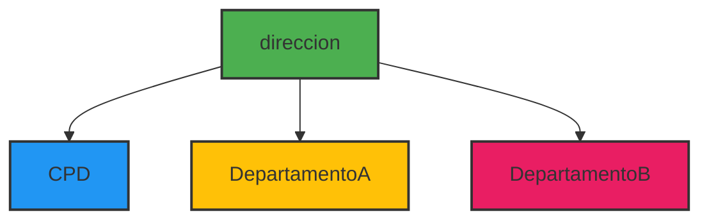
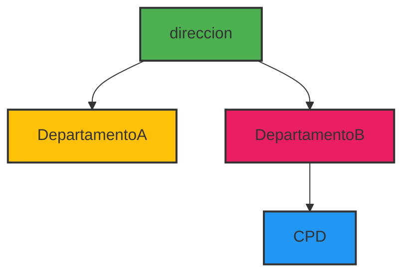
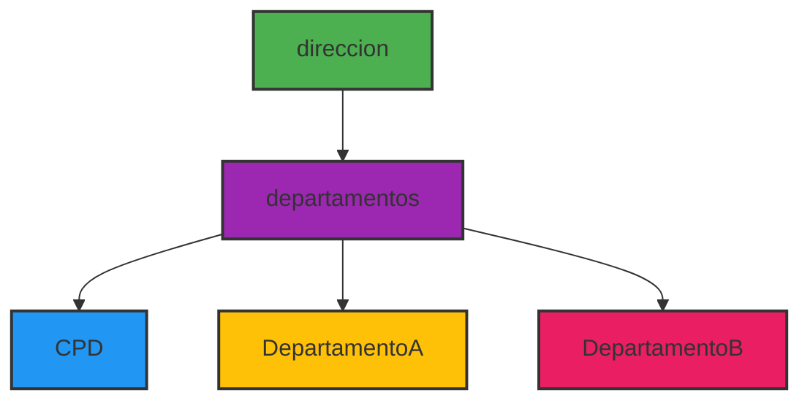

[[Tema 8-Organización de un CPD]]

### CPD centralizado
##### Dependiente de la dirección

```mermaid
graph TD;
  direccion --> CPD;
  direccion --> DepartamentoA;
  direccion --> DepartamentoB;

  style direccion fill:#4CAF50,stroke:#333,stroke-width:2px;
  style CPD fill:#2196F3,stroke:#333,stroke-width:2px;
  style DepartamentoA fill:#FFC107,stroke:#333,stroke-width:2px;
  style DepartamentoB fill:#E91E63,stroke:#333,stroke-width:2px;

```

##### Dependiente de un departamento

```mermaid
graph TD;
  direccion --> DepartamentoA;
  direccion --> DepartamentoB;
  DepartamentoB --> CPD;

  style direccion fill:#4CAF50,stroke:#333,stroke-width:2px;
  style CPD fill:#2196F3,stroke:#333,stroke-width:2px;
  style DepartamentoA fill:#FFC107,stroke:#333,stroke-width:2px;
  style DepartamentoB fill:#E91E63,stroke:#333,stroke-width:2px;

```

##### Independiente

```mermaid
graph TD;
  direccion --> departamentos;
  departamentos --> CPD;
  departamentos --> DepartamentoA;
  departamentos --> DepartamentoB;

  style direccion fill:#4CAF50,stroke:#333,stroke-width:2px;
  style CPD fill:#2196F3,stroke:#333,stroke-width:2px;
  style DepartamentoA fill:#FFC107,stroke:#333,stroke-width:2px;
  style DepartamentoB fill:#E91E63,stroke:#333,stroke-width:2px;
  style departamentos fill:#9C27B0,stroke:#333,stroke-width:2px;

```

### Descentralizado
