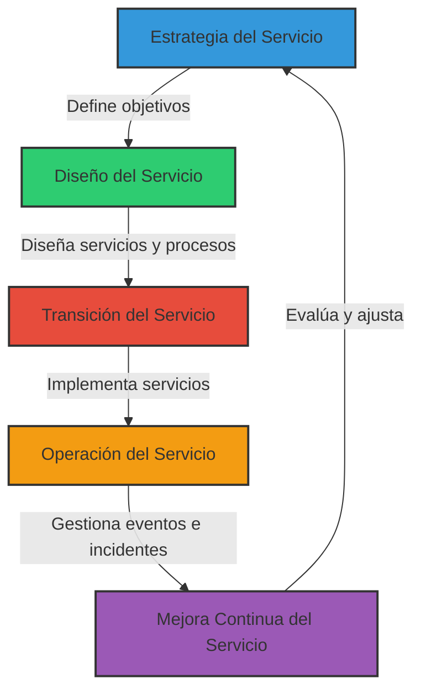

[[Tema 9-ITIL]]

## ¿Qué es un servicio?
Un servicio es un medio de proporcionar valor a los clientes facilitándoles los resultados (outcomes) que quieren obtener sin necesidad de que éstos asuman la responsabilidad (ownership) de los costes y riesgos específicos.

### Servicios TI
Un servicio TI es un servicio que proporciona un proveedor de servicios TI. Es normalmente una combinación de tecnología, personas y procesos. Pueden ser:
+ **De soporte:** servicio TI que no se utiliza directamente en el negocio pero que es necesario para que el proveedor TI pueda prestar los otros servicios. Por ejemplo, los servicios de backup.
+ **Visibles por el cliente:** servicios TI que ve el cliente y que normalmente dan soporte a sus procesos de negocio.
	+ **Al cliente interno:** servicio IT que apoya directamente a un proceso de negocio gestionado por otro departamento o unidad de la organización. Por ejemplo, bases de datos para los almacenes.
	+ **Al cliente externo:** servicio IT que se proporciona directamente a un cliente externo. Por ejemplo, el wifi de un aeropuerto.

Otra división es:
+ **Servicios Core:** proporcionan los resultados básicos que desea el cliente, el valor que éste busca y por el que está dispuesto a pagar. Por ejemplo, el servicio de gestión financiera.
+ **Servicios Enabling:** aquellos que son necesarios para prestar servicios Core. Por ejemplo, el servicio de actualización del gestor de BBDD.
+ **Servicios Enhancing:** se añaden a los servicios Core para hacerlos más atractivos de cara al cliente. Por ejemplo, la personalización de portales web.

## Valor de un servicio
Un servicio proporciona valor a los clientes facilitándoles los resultados que quieren obtener sin necesidad de que éstos asuman la responsabilidad de los costes y riesgos específicos. 

El valor de un servicio puede considerarse como el nivel o grado en que éste cumple las expectativas de los cliente. No tienen un valor intrínseco, su valor depende de la percepción del cliente. Aportan valor a una organización solamente cuando sus beneficios se perciben mayores que el coste de su obtención.

La utilidad es la funcionalidad que ofrece un producto o servicio para satisfacer una necesidad particular. Es adecuada al propósito. 

La garantía es la seguridad de que un producto o un servicio va a satisfacer los requerimientos acordados. Es adecuada al uso.

El valor se puede medir como:
$$Valor=Utilidad+Garantía$$

## Activos de un servicio
Los activos son los recursos y capacidades. Un recurso es término general que incluye infraestructura TI, personas, dinero o cualquier otra cosa que pueda ayudar a proporcionar un servicio TI. Según ITIL habría cinco grupos fundamentales: 
+ aplicaciones
+ infraestructura
+ capital financiero
+ información
+ personal

La capacidad es la : habilidad de una organización, persona, proceso, aplicación, servicio TI u otro ítem para llevar a cabo una actividad. Según ITIL habría cinco grupos fundamentales: 
+ conocimiento
+ procesos
+ gestión
+ organización
+ personal

Es más fácil obtener recursos que capacidades. Las capacidades distintivas de un proveedor de servicios son las que hacen que se diferencie de la competencia y le permiten atraer y conservar clientes. Realmente las capacidades son lo que más valor da a una organización.

## Componentes de un servicio TI
Un servicio está formado por:
+ Proceso de negocio
+ El propio servicio
+ Paquete de diseño del servicio
+ Justificación de negocio
+ Infraestructura
+ Entorno
+ Datos
+ Aplicaciones
+ Integración
+ Acuerdos y requerimientos de servicio
+ Acuerdos operacionales
+ Servicios de soporte
+ Procesos TI
+ Funciones
+ Roles
+ Suministradores

## Gestión de un servicio TI
Un paquete de servicios es una Colección de dos o más servicios que se han combinado para ofrecer una solución a un tipo de necesidad específica de un cliente o para soportar resultados de negocio específicos. Pueden estar nivelados para adaptarse a varios tipos de cliente.

La Gestión de Servicios TI la llevan a cabo los proveedores de servicios TI a través de personas, procesos y tecnología. El núcleo central de la Gestión de Servicios TI es la transformación de recursos en servicios con valor. Es una práctica profesional apoyada por conocimiento, experiencia y habilidades específicas.

Las partes interesadas en la gestión de TI son las partes interesadas en una organización, proyecto o servicio que pueden tener interés en las actividades, recursos, objetivos o prestaciones de la gestión de servicios:
+ La propia organización
+ Proveedores
	+ Internos
	+ Externos
	+ Compartidos
+ Clientes
	+ Internos
	+ Externos
+ Usuarios
+ Socios
+ Empleados
+ Propietarios
+ Suministradores
+ Accionistas

La gestión racional de los servicios de TI proporciona:
+ Información para la toma de decisiones.
+ Responsabilidades bien definidas.
+ Flexibilidad y capacidad de adaptación a los cambios.
+ Mejora la calidad del servicio.
+ Mejora la comunicación con el usuario o cliente.
+ Seguridad, disponibilidad y rendimiento.

## Ciclo de vida

