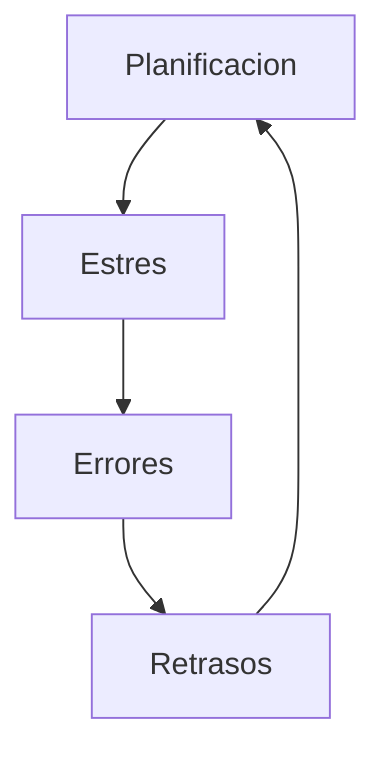

[[Tema 2-Gestión y planificación de proyectos]]

### Planificación
Idealmente para planificar se realiza una estimación. Con ella se puede planificar y, al final, realizar un seguimiento de esta.

Pero en la realidad los jefes, clientes y determinadas situaciones plantean plazos o costes que no se adaptan a nuestra planificación. Por tanto, es necesario lograr que la planificación sea aceptada y evitar fechas inalcanzables.

##### Planificación excesivamente optimista
En el desarrollo de software siempre ha sido demasiado optimista la planificación. Las consecuencias de una planificación demasiado optimista son:
+ Toma de todos los atajos posibles
+ Pérdidas monetarias, de calidad y de integridad del producto.

Existen 3 factores que conllevan a la aparición de problemas asociados a este optimismo:
+ Deseo del mejor resultado posible en el menor tiempo posible.
+ Pocos conocimiento sobre estimación.
+ Poca habilidad para negociar.

### Negociación
Los desarrolladores tienden a ser malos negociando porque:
+ Tienden a ser personas muy introvertidas
+ Suelen ser jóvenes y sin experiencia de negociación
+ No suelen utilizar trucos de negociación ni ofrecer estimaciones iniciales

No es bueno utilizar trucos de negociación, ya que generalmente los jefes y expertos saben como contrarrestarlos.

#### Negociación conveniente
Es un tipo de negociación que busca ventajas para ambos bandos. No confía en los trucos de negociación pero si explica como responder a ellos cuando otros la utilizan. Es una estrategia abierta, es decir, no se cierra en unos pasos concretos. Se basa en:
+ Crear alternativas para las dos partes
+ No intentar derrotar a la otra persona
+ Intentar que las dos partes ganen

##### Partes
+ **PERSONAS (Separar las personas del problema):** Hay que tener en cuenta las diferencias de personalidad, comprender la posición y postura del lado contrario e intentar no personalizar las posiciones y posturas. Las posturas a veces se deben a fechas o presiones. En esos casos se debe intentar entender la postura de la otra parte y proponer soluciones y cambios.
+ **INTERESES (Centrarse en los intereses, no en las posiciones):** Las posiciones son muy estrictas y normalmente hacen que una parte gane y otra pierda. Nunca se debe negociar centrándose en las posiciones, sino en los intereses. Por ejemplo, a veces se exige una fecha de entrega para todo el proyecto, cuando solo son necesarios ciertos módulos. Una posible solución sería un proyecto incremental y realizar para la primera fechas los módulos que se necesiten.
+ **OPCIONES (Inventar opciones para beneficios mutuos):** Una buena negociación consiste en un ejercicio creativo para resolver un problema. Es la parte más importante para un técnico, porque es quien tiene los conocimientos para generar posibles soluciones. Esto es una ventaja, pero también una responsabilidad. Algunos ejemplos de soluciones técnicas son: entregas incrementales, reducción o eliminación de prestaciones, etc. Una advertencia es que a veces lo que parece buena solución en el momento, más tarde puede ser difícil de realizar. Un consejo es no comprometerse nunca firmemente con las nuevas opciones hasta que estén analizadas con cuidado y tiempo. Para ello hay que centrarse en lo que se puede hacer, no en lo que no se puede hacer.
+ **CRITERIOS (Insistir en la utilización de criterios objetivos):** 
