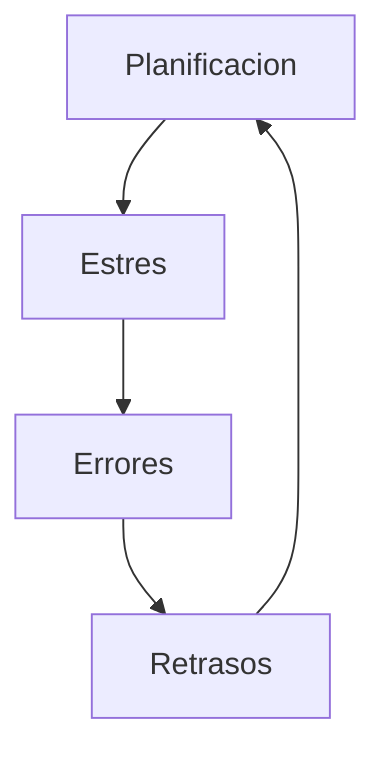

[[Tema 2-Gestión y planificación de proyectos]]

## Planificación
Idealmente para planificar se realiza una estimación. Con ella se puede planificar y, al final, realizar un seguimiento de esta.

Pero en la realidad los jefes, clientes y determinadas situaciones plantean plazos o costes que no se adaptan a nuestra planificación. Por tanto, es necesario lograr que la planificación sea aceptada y evitar fechas inalcanzables.

### Planificación excesivamente optimista
En el desarrollo de software siempre ha sido demasiado optimista la planificación. Las consecuencias de una planificación demasiado optimista son:
+ Toma de todos los atajos posibles y soluciones poco pensadas.
+ Pérdidas monetarias, de calidad y de integridad del producto.

Existen 3 factores que conllevan a la aparición de problemas asociados a este optimismo:
+ Deseo del mejor resultado posible en el menor tiempo posible.
+ Pocos conocimiento sobre estimación.
+ Poca habilidad para negociar.

## Negociación
Los desarrolladores tienden a ser malos negociando porque:
+ Tienden a ser personas muy introvertidas.
+ Suelen ser jóvenes y sin experiencia de negociación.
+ No suelen utilizar trucos de negociación ni ofrecer estimaciones iniciales.

No es bueno utilizar trucos de negociación, ya que generalmente los jefes y expertos saben como contrarrestarlos.

### Negociación conveniente
Es un tipo de negociación que busca ventajas para ambos bandos. No confía en los trucos de negociación pero si explica como responder a ellos cuando otros la utilizan. Es una estrategia abierta, es decir, no se cierra en unos pasos concretos. Se basa en:
+ Crear alternativas para las dos partes.
+ No intentar derrotar a la otra persona.
+ Intentar que las dos partes ganen.
+ Es una estrategia abierta.
+ Es bueno que la otra persona conozca este método.

Las partes que intervienen en la negociación conveniente son:
+ **PERSONAS (Separar las personas del problema):** Hay que tener en cuenta las diferencias de personalidad, comprender la posición y postura del lado contrario e intentar no personalizar las posiciones y posturas. Las posturas a veces se deben a fechas o presiones. En esos casos se debe intentar entender la postura de la otra parte y proponer soluciones y cambios.
+ **INTERESES (Centrarse en los intereses, no en las posiciones):** Las posiciones son muy estrictas y normalmente hacen que una parte gane y otra pierda. Nunca se debe negociar centrándose en las posiciones, sino en los intereses. Por ejemplo, a veces se exige una fecha de entrega para todo el proyecto, cuando solo son necesarios ciertos módulos. Una posible solución sería un proyecto incremental y realizar para la primera fechas los módulos que se necesiten.
+ **OPCIONES (Inventar opciones para beneficios mutuos):** Una buena negociación consiste en un ejercicio creativo para resolver un problema. Es la parte más importante para un técnico, porque es quien tiene los conocimientos para generar posibles soluciones. Esto es una ventaja, pero también una responsabilidad. Algunos ejemplos de soluciones técnicas son: entregas incrementales, reducción o eliminación de prestaciones, etc. Una advertencia es que a veces lo que parece buena solución en el momento, más tarde puede ser difícil de realizar. Un consejo es no comprometerse nunca firmemente con las nuevas opciones hasta que estén analizadas con cuidado y tiempo. Para ello hay que centrarse en lo que se puede hacer, no en lo que no se puede hacer.
+ **CRITERIOS (Insistir en la utilización de criterios objetivos):** Seguir ciertos criterios permite evitar bloqueos en las negociaciones convenientes. Esto supone presentar criterios objetivos, mantenerse abierto a sugerencias, discutir sobre los criterios y no ceder a la presión. Normalmente cuando una estimación produce estimaciones no deseadas, el gerente o el cliente tiende a obviarlas. Por ello, no se debe negociar la propia estimación, sino los elementos que se emplean para estimar; la estimación debe ser elaborada por alguien cualificado y hay que seguir el siguiente procedimiento: comprometerse antes con los requisitos que con la estimación, proporcionar mejores estimación a lo largo del avance del proyecto y volver a estimar si se cambian los requisitos.

## Comunicación
Para negociar es necesario saber comunicarse correctamente. La comunicación ayuda, a demás de a negociar, a mejorar las relaciones con compañeros, clientes, jefes, etc.

### Comunicación eficaz
La comunicación eficaz entre dos personas ocurre cuando el receptor interpreta el mensaje en el sentido que pretende el emisor. Es importante tanto la comunicación verbal como la no verbal.

Algunas técnicas de comunicación eficaz básicas son:
+ Escucha activa. Hay que saber escuchar y entender la comunicación desde el punto de vista del emisor. Se debe mostrar que se esta escuchando activamente.
+ No criticar al receptor.
+ Discutir los temas uno a uno.
+ No acumular enfado.
+ Rememorar solo el pasado constructivamente.
+ Ser específico y concreto.
+ Evitar las generalidades.
+ Ser breve.
+ Elegir el lugar y momento correctos.

### Comunicación asertiva
Una persona asertiva es aquella que:
+ Manifiesta siempre su propia postura.
+ Expresa su razonamiento cuando explica o justifica.
+ Puede cambiar de opinión.
+ Es comprensiva.
+ Pide lo que necesita.
+ Pide aclaraciones.
+ Expresa gratitud, afecto, admiración...

En una comunicación asertiva se utilizan estas técnicas:
+ **Mensajes YO:** describen tu sentimiento conforme al comportamiento de la otra persona. Por ejemplo: "Cuando tú añades este elemento a la interfaz, y, que soy daltónico, no puedo apreciar el contraste; por lo que por favor, utiliza otra paleta de colores".
+ **Disco rayado:** Repetir de forma persistente el mensaje de lo que se quiere transmitir, de forma relajada. Por ejemplo: Compañero: "Creo que deberías encargarte de la presentación del próximo proyecto. Tienes experiencia en ello." Tú: "Entiendo tu punto de vista y aprecio que confíes en mis habilidades. Sin embargo, en este momento estoy enfocado en otras tareas prioritarias que ya tengo asignadas." Compañero: "Pero realmente creo que serías el mejor para esto. Todos confían en ti." Tú: "Agradezco tu confianza en mí. Mi enfoque actual es completar las responsabilidades que ya me han sido asignadas. Si hay alguna manera en la que pueda apoyarte sin comprometer mis responsabilidades actuales, estaré encantado de ayudar."
+ **Banco de niebla:** Consiste en reconocerle parcialmente la razón a la otra parte, sin cambiar de postura, para frenar la discusión. Colega: "Siempre haces las cosas a tu manera y no tomas en cuenta las opiniones del resto del equipo. Es frustrante trabajar contigo." Tú (aplicando la técnica del banco de niebla): "Entiendo que puedas sentir eso. Aprecio tus comentarios y tomaré en cuenta lo que dices. Trabajar juntos es importante para mí, así que estaré atento a cómo puedo mejorar nuestra colaboración."
+ **Aplazamiento asertivo:** Consiste en aplazar la respuesta hasta encontrarse más cómodo para responder. Por ejemplo: Colega: "Necesitamos que te encargues de coordinar el próximo evento. ¿Puedes encargarte de eso?" Tú (aplicando el aplazamiento asertivo): "Aprecio que confíes en mí para coordinar el evento. En este momento, mi carga de trabajo está bastante intensa, y quiero asegurarme de dedicarle la atención necesaria a cada responsabilidad. ¿Sería posible discutirlo más detalladamente mañana por la mañana? Así podré revisar mi agenda y asegurarme de ofrecer la mejor contribución posible."
+ **Ignorar:** Ignorar a la otra persona si se enfada.
+ **Preguntas asertivas:** Consiste en pedir aclaraciones que soporte las críticas. Por ejemplo: "He notado que hay algunas tareas en el proyecto que aún no han sido asignadas o completadas. ¿Cómo podemos distribuir de manera equitativa las responsabilidades para asegurarnos de que todos estemos contribuyendo de manera efectiva?".