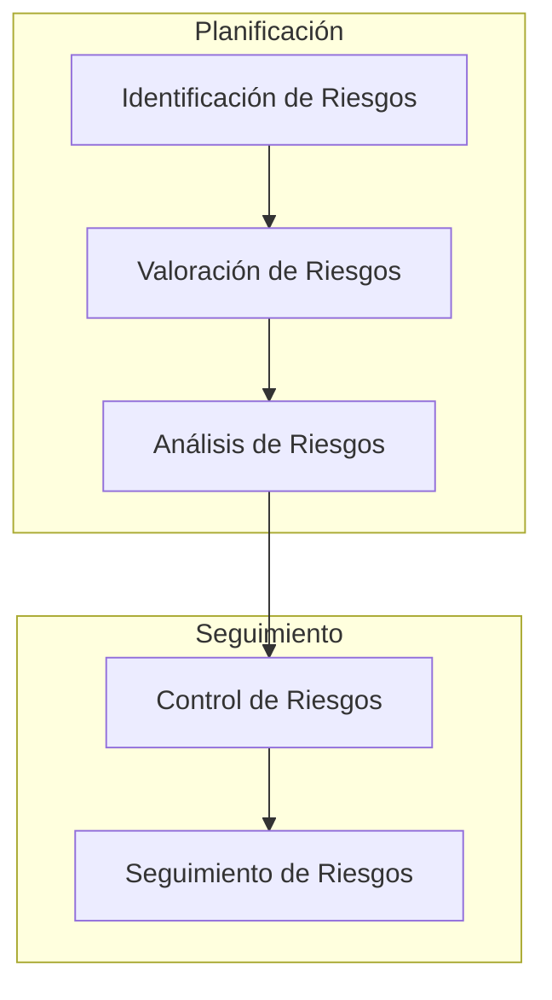

[[Tema 3-Gestión de riesgos]]

## Definición de riesgo
Un riesgo es un evento que que podría reducir la capacidad para lograr los objetivos definidos en un proyecto, es decir, la probabilidad de que en un punto del ciclo de vida no se alcancen los objetivos propuestos con los recursos disponibles.

Los riesgos tienen una causa y una consecuencia o efecto.

### Clasificación de riesgos
+ **Estratégicos:** están relacionados con la estrategia de la organización. Por ejemplo, una pérdida de mercado.
+ **Comerciales:** están relacionados con las ventas, el seguimiento del cliente, el precio y todo el proceso de venta. Por ejemplo, un venta a bajo precio.
+ **Contractuales y financieros:** están relacionados con los términos negociados antes de la firma del contrato. Por ejemplo, los relacionados con calendarios de pagos, obligaciones...
+ **De gestión:** están relacionados con la organización de los proyectos. Por ejemplo, los relacionados con los recursos y equipos, subcontratas...
+ **De proyecto:** están relacionados con los aspectos técnicos del software. Por ejemplo, los relacionados con el diseño, desarrollo...
+ **De explotación:** están relacionados con la explotación. Por ejemplo, accidentes laborales.

## ¿Cómo se gestionan los riesgos?
Existen dos alternativas:
+ **Gestión de problemas (bombero):** se solucionan los problemas según van apareciendo.
+ **Gestión de riesgos (gestor):** se intentan reducir los impactos de los riesgos mediante planes.

### Fases

+ **Identificación:** búsqueda de posibles riesgos y, opcionalmente, clasificación y agrupación.
+ **Valoración:** cuantificación, priorización y umbrales de actuación antes un riesgo.
+ **Análisis:** estudio de alternativas, contención y prevención.
+ **Control y seguimiento:** implantación de las estrategias de mitigación, seguimiento de riesgos relevantes y actividades de contingencia.

