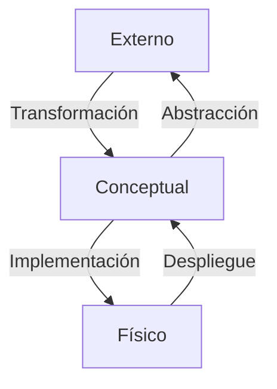

[[Catálogo]]

## Consultas de usuario
Podemos consultar las columnas de la tabla `emp`:
```sql
select column_name, data_type
from information_schema.columns
where table_name='EMP';
```

## Contenido
El catálogo tiene un esquema conceptual:

