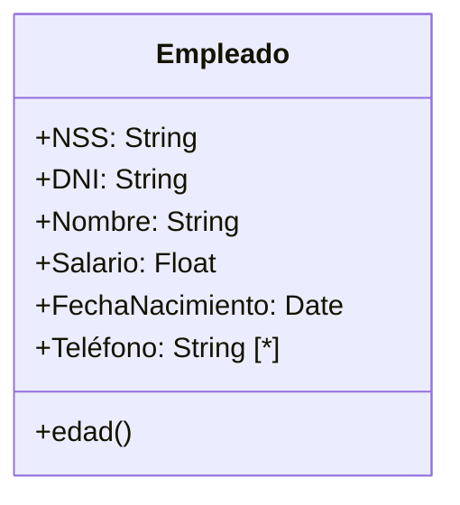
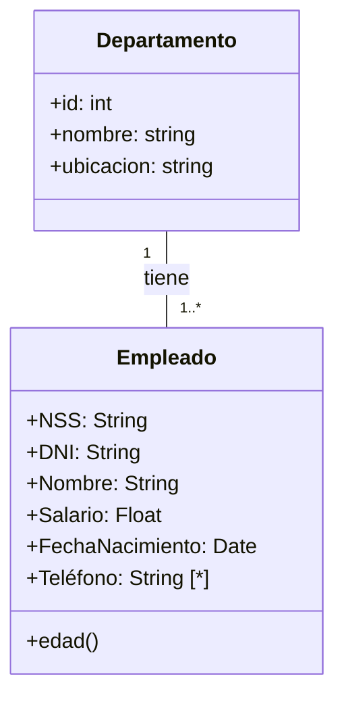

[[Bases de datos avanzadas]]

# 1.UML y conceptos avanzados
## 1.1.Clases y atributos
### 1.1.1.Clases
Una clase es similar a una entidad en el modelo entidad-relación. Es un elemento del mundo real sobre el que almacenamos información.

Un ejemplo de clase podría ser:


### 1.1.2.Atributos
Un atributo es una propiedad atómica de una clase. Los tipos de datos ayudan a describir el dominio de un atributo. Estos son:
+ [>] String
+ [>] Integer
+ [>] Float
+ [>] Date
+ [>] Boolean
+ [>] File

Los atributos pueden ser:
+ [>] *Identificadores:* identifican de forma inequívoca a los elementos de una clase. Pueden ser naturales, como el DNI o el NSS, o artificiales, enteros arbitrarios que no se indican.
+ [>] *Multivaluados:* tienen más de un valor para un solo atributo. Por ejemplo, una persona puede tener varios teléfonos. Se indican con \[\*].
+ [>] *Compuestos:* subatributos de un atributo. Se indican creando una nueva clase.
+ [>] *Derivados:* se calculan a través de otros atributos. Se indican como métodos. 

## 1.2.Asociaciones
Una asociación es una relación entre objetos de dos clases. Debe darse un nombre significativo a la relación.

### 1.2.1.Multiplicidad
La multiplicidad es el número máximo y mínimo de objetos de una clase que pueden participar en la relación. Se especifica a lado de la clase.

| Notación | Mínimo | Máximo |
| ---- | ---- | ---- |
| 1..1, 1 o sin indicación de multiplicidad | 1 | 1 |
| 0..1 | 0 | 1 |
| 0..\* o \* | 0 | Varios |
| 1..* | 1 | Varios |
| m...n (números concretos) | m | n |
Por ejemplo:


### 1.2.2.Clases asociación
Una relación puede tener atributos. Se modelan como clases vinculadas a la relación con una línea discontinua.

![[clase asociación.png]]

Cuando en un dominio puede haber varias relaciones entre un par de clases no podemos usar clases asociación. Por ejemplo, el socio 1 puede reservar la pista 1 dos veces. Para modelar esto se crea una clase intermedia entre Socio y Pista, llamada Reserva, con relaciones 0...1 a \* reservas.

![[clases asociación 2.png]]

## 1.3.Agregación y composición
### 1.3.1.Agregación
Es un tipo de relación que indica que un objeto está compuesto por otros. Se llaman compuesto y componentes las partes. Por ejemplo, el compuesto Receta tiene 1..\* ingredientes. Se modela con un rombo blanco del lado del compuesto.

![[agregación.png]]

### 1.3.2.Composición
Es un tipo de agregación que indica que un objeto está compuesto por otros mediante una dependencia de existencia, es decir, el compuesto no puede existir si no existen los componentes. Representa las entidades débiles del modelo entidad-relación. Se modela con un rombo negro del lado del compuesto.

![[composición.png]]

Tiene ciertas restricciones:
+ [>] Cada componente puede estar en un único compuesto.
+ [>] Al eliminar un compuesto se eliminan los componentes. 


## 1.4.Superclases y subclases
Las subclases son conjuntos de objetos de la superclase que tienen atributos específicos o que se relacionan de una forma concreta con otras clases. Todos los objetos de la subclase forman parte de la superclase, aunque no todos los objetos de la superclase tienen por qué ser de una subclase. Se definen la participación y la distribución entre llaves.

La participación puede ser:
+ [>] *Total:* todos los objetos de la superclase pertenecen a alguna subclase.
+ [>] *Parcial:* existen objetos de la superclase que no pertenecen a ninguna subclase.

La distribución puede ser:
+ [>] *Disjunta:* un objeto de la superclase no forma parte de más de una subclase.
+ [>] *Solapada:* un objeto de la superclase puede formar parte de varias subclases. 

![[subclases y superclases.png]]

### 1.4.1.Generalización y especialización
Son procesos que permiten identificar subclases. La generalización consiste en agrupar clases con propiedades y características comunes en una superclase que las recoja. La especialización es el proceso inverso. Consiste en identificar atributos en ciertos objetos de la superclase que no presenten otros objetos.

### 1.4.2.Jerarquías
Una subclase puede ser superclase de otras. Los atributos y asociaciones se heredan a lo largo de la jerarquía.

 La herencia puede ser múltiple. Una subclase puede tener más de una superclase. Heredará todos los atributos de todas las superclases de las que hereda.

![[jerarquias.png]]


# 2. Ejercicio
Propón seis dominios  reales que necesiten uno de estos elementos para ser modelados como un diagrama de clases UML.
+ [>] *Asociación recursiva:* carpeta padre y carpetas hijas.
+ [>] *Clase asociación:* alumno que saca una nota en una asignatura.
+ [>] *Relación m-n con clase asociación que evoluciona a clase normal:* personas que participan en pruebas deportivas.
+ [>] *Agregación:* un supermercado contiene menciones.
+ [>] *Composición:* un esqueleto está formado por huesos.
+ [>] *Especialización/generalización:* las asignaturas pueden ser de ciencias o letras.

# 3. Esquema relacional
Un esquema relacional solo especifica las tablas, atributos, claves primarias y claves foráneas.

```
TABLA1(_id_, atr1, atr2, ..., atrN)
TABLA 2(_id_, atr1, atr2, ..., atrN, idTabla1)

idTabla1 FK id(TABLA1)
```

## 3.1.Clases y atributos
Cada clase genera una tabla. La clave principal de la tabla es el identificador de cada clase. Los atributos pueden ser:
+ [>] *Simples:* son atributos de la tabla.
+ [>] *Calculados:* no se pasan al esquema relacional.
+ [>] *Multivaluados:* generan una tabla nueva que se llama igual que el atributo y contiene un id artificial, el atributo en sí y el id de la clase que actúa como clave foránea.
+ [>] *Compuestos:*  son una clase normal.

## 3.2.Asociaciones
La transformación al relacional depende de la multiplicidad de la asociación. Los atributos de las clases asociación se añaden a las tablas que contienen la clave foránea de la relación.
### 3.2.2.Relación 1:1
Las relaciones 1:1 no tienen mucho sentido. Suelen darse en relaciones 0...1 a 1. La clave foránea se pone en la tabla que tiene participación total en la relación, es decir, el lado de multiplicidad mínima 1.

![[relacion 1 1.png]]

### 3.2.2.Relación 1:N
La clave foránea se pone en la tabla del lado N. 

![[relacion 1 N.png]]

### 3.2.3.Relación N:M
Se crea una nueva tabla con un id artificial y como claves foráneas el id de la tabla N y el id de la tabla M.

![[relacion N M.png]]

## 3.3.Jerarquías
Existen varias posibilidades de modelado:
+ [>] *Una tabla por clase:* se crea una tabla para cada clase con sus propios atributos. Las tablas de las subclases tienen como identificador el identificador de la superclase, que a su vez actúa como clave foránea.
+ [>] *Una tabla para cada subclase:* solo funciona en jerarquías totales y disjuntas. Se crea una tabla para cada superclase que contiene  además de sus atributos, todos los atributos y relaciones de la superclase.
+ [>] *Una única tabla:* se crea una sola tabla. Para distinguir las subclases se añade un atributo discriminador si es disjunta o un booleano por cada subclase si es solapada.

### 3.3.1.Ejemplos
#### 3.3.1.1.Ejemplo 1
![[ejemplo 1 jerarquia.png]]

#### 3.3.1.2.Ejemplo 2
![[ejemplo 2 jerarquia.png]]

![[ejemplo 3 jerarquia.png]]

# 4.Diccionario de datos
Un diccionario de datos es un repositorio de información que almacena metadatos sobre las tablas y sus atributos. Sirve para documentar la base de datos y estudiar el impacto de los cambios que se tengan que hacer. Se suelen usar documentos de texto o hojas de cálculo.

## 4.1.Contenido
Cada tabla debe contener su nombre, una descripción y los atributos que la componen. Para cada atributo se debe dar:
+ [>] Nombre
+ [>] Tipo de dato
+ [>] Especificación de clave primaria o foránea
+ [>] Restricciones `Unique` y `Not null`.
+ [>] Descripción

| **Clave** | **Atributo**  | **Tipo**    | **Restricciones** | **Descripción**                                                       |
| --------- | ------------- | ----------- | ----------------- | --------------------------------------------------------------------- |
| PK        | Id            | BigInt      |                   | Autogenerado por el SGBD.                                             |
|           | exlibris      | Text        |                   | Notas al margen del ejemplar.                                         |
|           | observacions  | Text        |                   | Comentarios relevantes sobre el ejemplar.                             |
| FK        | Id-biblioteca | BigInt      | Not null          | Biblioteca en la que está depositado el ejemplar.                     |
|           | signatura<br> | Varchar(20) | Not null / Unique | Código asignado al exemplar por la biblioteca en que está depositado. |
| FK        | Id-edicion    | BigInt      | Not null          | Edición a la que pertenece el ejemplar.                               |

# 5.Ejercicios de modelado
## 5.1.Catálogo de relaciones de sucesos


## 5.2.Residencia de mayores


## 5.3.Learning Management System