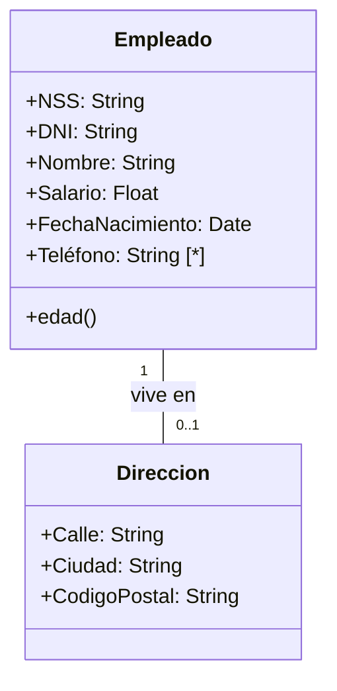

[[Bases de datos avanzadas]]

## Notación UML e conceptos avanzados
### Clases y atributos
Una clase es una entidad en el modelo E/R. Es un conjunto de objetos.

Un atributos es una propiedad atómica de un objeto de esa clase. Los tipos de datos que permiten describir los dominios de un atributo son:
+ String
+ Integer
+ Float
+ Date
+ Boolean
+ File

### Tipos de atributos
Los identificadores pueden ser naturales o artificiales. Los naturales son aquellos que nos permiten identificar de forma inequívoca a los elementos de una clase. Los artificiales son IDs arbitrarios. No se ponen.

Los atributos multivaluados se indican con \[\*] al lado de la definición del atributo.

Los atributos compuestos se dan cuando queremos hacer consultas sobre ciertos subatributos de un atributo. Para ello se crea un nueva clase.

Los atributos derivados son aquellos que se calculan a partir de otros. Se indican como métodos.

### Asociaciones
Es una asociación entre objetos de dos clases. La multiplicidad es el número mínimo y máximo de objetos de clase que pueden participar en una relación. Se especifica en el extremo apuesto a la clase en una asociación. 

| Notación               | Mínimo | Máximo   |
|------------------------|--------|----------|
| 1..1, 1 (sin indicación)| 1      | 1        |
| 0..1                   | 0      | 1        |
| 0..* o *               | 0      | Varios   |
| 1..*                   | 1      | Varios   |
| m..n (números concretos)| m      | n        |

### Clases asociación
Los atributos en las asociaciones se modelan como clases con el nombre de la relación vinculadas a la relación con un trazo discontinuo.

![[clase asociación.png]]

Cuando en un dominio es necesario representar el hecho de que pueda hacer más de una relación entre un par de objetos no podemos usar las clases asociación. Ocurre por ejemplo con una reserva de socios y pistas. Se indica como una clase con relaciones con las entidades originales.

![[clases asociación 2.png]]

