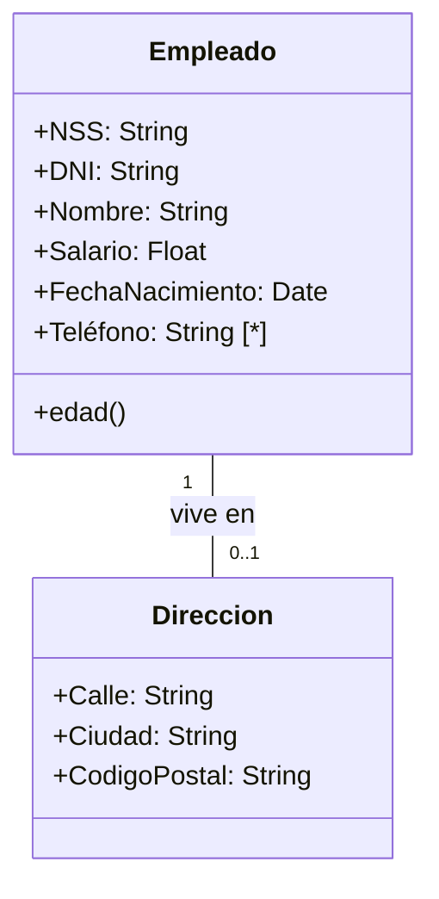

[[Bases de datos avanzadas]]

# Notación UML y conceptos avanzados
## Clases y atributos
Una clase es una entidad en el modelo E/R. Es un elemento del mundo real sobre el que almacenamos información.

Un atributo es una propiedad atómica de un objeto de esa clase. Los tipos de datos permiten describir los dominios de un atributo.
+ [<] **Tipos de datos:**
+ String
+ Integer
+ Float
+ Date
+ Boolean
+ File

Un ejemplo de clases:



### Tipos de atributos
Los identificadores pueden ser naturales o artificiales. Los naturales son aquellos que nos permiten identificar de forma inequívoca a los elementos de una clase. Los artificiales son IDs arbitrarios que no se ponen.

Los atributos multivaluados se indican con \[\*] al lado de la definición del atributo.

Los atributos compuestos se dan cuando queremos hacer consultas sobre ciertos subatributos de un atributo. Para ello se crea un nueva clase.

Los atributos derivados son aquellos que se calculan a partir de otros. Se indican como métodos.

## Asociaciones
Una asociación es una relación entre objetos de dos clases. La multiplicidad es el número mínimo y máximo de objetos de clase que pueden participar en una relación. Se especifica en el extremo opuesto a la clase en una asociación. 

| Notación | Mínimo | Máximo |  |
| ---- | ---- | ---- | ---- |
| 1..1, 1 (sin indicación) | 1 | 1 |  |
| 0..1 | 0 | 1 |  |
| 0..\* o \* | 0 | Varios |  |
| 1..* | 1 | Varios |  |
| m...n (números concretos) | m | n |  |

### Clases asociación
Los atributos en las asociaciones se modelan como clases con el nombre de la relación vinculadas a la relación con un trazo discontinuo.

![[clase asociación.png]]

Cuando en un dominio es necesario representar el hecho de que pueda hacer más de una relación entre un par de objetos no podemos usar las clases asociación. Ocurre por ejemplo con una reserva de socios y pistas. Se indica como una clase con relaciones con las entidades originales.

![[clases asociación 2.png]]

## Agregación
Es una relación de tipo parte-todo. El todo se llama compuesto y la parte componente. Se modela con un rombo blanco. Indica "está formado por".
![[agregación.png]]

## Composición
Es una agregación donde el componente tiene multiplicidad máxima 1 y tiene que existir. Cada componente puede estar en un único compuesto. Si eliminamos el compuesto también se deben eliminar los componentes.
![[composición.png]]

## Superclases y subclases
Las subclases están formadas por conjuntos de objetos de la superclase con propiedades específicas o que se relacionan de formas específicas con otras clases.
![[subclases y superclases.png]]

### Generalización o especialización
Son procesos por los que se encuentran superclases y subclases. La generalización parte de subclases a superclases y la especialización de la superclases a la subclases.

La generalización tiene el riesgo de que a veces no es necesaria. Por ejemplo, si siempre vamos a tener separados profesores y alumnos no tiene sentido juntarlos en una superclase.

+ [<] **Participación:** 
+ *Total:* todos los objetos de la superclase pertenecen a una subclase.
+ *Parcial:* hay objetos de la superclase que no son de ninguna subclase.
+ [<] **Distribución:** 
+ *Disjunta:* un objeto de la superclase no forma parte de más de una subclase.
+ *Solapada:* un objeto de la superclase puede formar parte de varias subclases.

Se definen entre llaves:
```
{total, disjunta}
```

### Jerarquía
Una subclase puede ser superclase de otras. Los atributos y asociaciones se heredan a lo largo de la jerarquía.

 La herencia puede ser múltiple. Una subclase puede tener más de una superclase.

# Ejercicios
+ [n] **Asociación recursiva:** carpeta padre de carpetas.
+ [n] **Clase asociación:** persona--compra--producto
+ [n] **Relación m-n con clase asociación:** 
+ [n] **Agregación:** planta--aulas
+ [n] **Composición:** esqueleto--huesos
+ [n] **Especialización/generalización:** asignaturas--{ciencias, letras} 

# Esquema relacional y diccioanrio de datos
## Esquema relacional
+ [<] **Especificamos:**
+ Tablas
+ Atributos
+ Claves primarias
+ Claves foráneas

### Estructura
```
TABLA(_id_, atr1, atr2, ..., atrN)
```

## Elementos
### Clases
Cada clase es una tabla.

### Atributos calculados
No se pasan al relacional.

### Atributos multivaluados
Generan una tabla nueva que se se llama igual que el atributo. Llevan un id artificial autogenerado, el atributo en sí, y una `CF` al id de la clase de la que viene.

### Asociaciones
![[asociaciones relacional.png]]

