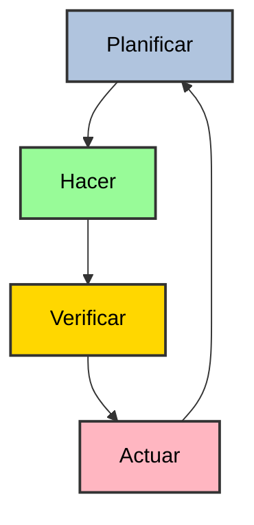

[[Seguridad]]

# 1.Seguridad en las organizaciones
La seguridad es fundamental para cualquier organización. Se centra en garantizar:
+ [>] *Confidencialidad:* proteger datos privados ante accesos no autorizados.
+ [>] *Disponibilidad:* dar acceso a todos los datos a los que haya permiso de acceso.
+ [>] *Integridad:* evitar modificaciones no adecuadas y daños en la información.

$\space$
La seguridad está vinculada a elementos muy diversos:
+ [>] Edificios
+ [>] Personas
+ [>] Dispositivos
+ [>] Sistemas operativos
+ [>] Comunicaciones
+ [>] Software
+ [>] Bases de datos 

## 1.1.Normas de seguridad
### 1.1.1.Legislación vigente
Es obligatorio cumplir con la LOPD y con el RGPD. Esto incluye los derechos de disposición de la información, de confidencialidad, etc.

### 1.1.2.Normas específicas
Cada organización dispone de distintos niveles de seguridad. Esto implica tener varios grupos de usuarios con ciertos permisos de acceso a los datos y una serie de acciones permitidas.

# 2.ISO 27001
La ISO 27001 es un estándar de seguridad de información que permite establecer los requisitos necesarios para crear, mantener y mejorar un Sistema de Gestión de Seguridad de la Información en una organización. Son un conjunto de buenas prácticas que permiten a las organizaciones gestionar los riesgos e incluso evitarlos.

El análisis de riesgos se basa en:
+ [>] Inventario de activos
+ [>] Inventario de amenazas
+ [>] Definición de nivel de riesgo aceptable

## 2.1.Ciclo de Deming
La ISO 27001 se basa en el ciclo de Deming o Plan-Do-Check-Act.

La metodología Plan-Do-Check-Act se basa en:
+ *Plan:* establecer objetivos y procesos y hacer una planificación temporal.
+ *Do:* implementar los objetivos y procesos.
+ *Check:* verificar el éxito o fracaso de las medidas.
+ *Act:* poner en marcha los cambios necesarios encontrados en la fase anterior. 

# 3.Seguridad en las bases de datos
La seguridad se implementa en los gestores de bases de datos para proteger las BD de amenazas y ataques. Los ataques pueden producir:
+ [>] Pérdidas de confidencialidad.
+ [>] No disponibilidad.
+ [>] Pérdida de integridad.

## 3.1.Medidas ante riesgos
Podemos implementar medidas para contrarrestar o eliminar riesgos:
+ [>] Control de acceso
	+ [>] Obligatorio
	+ [>]  Discrecional
+ [>] BD estadísticas 
+ [>] Cifrado de datos
+ [>] Auditorías