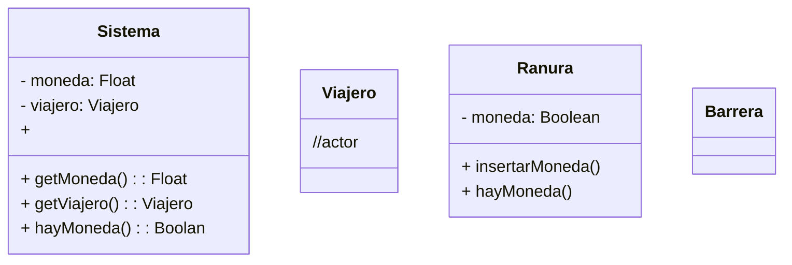

[[Tema 4-Diagramas de clases en ingeniería de requisitos]]

# 1.Objetivo

# 2.Soluciones

# 3.Requisitos
Como requisitos tenemos:
+ [>] Cuando un usuario mete una moneda, el torno se desbloquea.

# 4.Partes
## 4.1.Entorno

## 4.2.Interfaz

## 4.3.Sistema

# 5.Diagrama de clases

