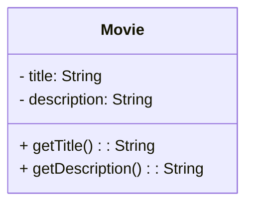

[[Tema 4-Diagramas de clases en ingeniería de requisitos]]

# 1.Clases
```java
public class Movie{
	private String title;
	private String description;

	public Movie(String title, String desccription) {
		this.tile=title;
		this.description=description;
	}

	private String getTitle(){
		return title;
	}

	private String getDescription(){
		return description;
	}
}
```


# 2.Pautas
Nos podemos basar en 4 pautas para realizar un diagrama de clases:
+ [>] Listar las clases relacionadas con el proyecto y las operaciones que pueden hacer.
+ [>]  