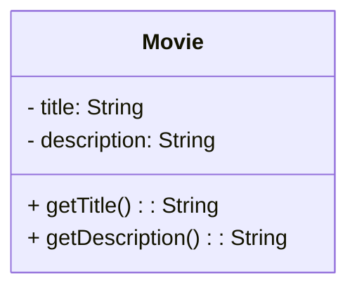

[[Tema 4-Diagramas de clases en ingeniería de requisitos]]
$\space$
## 1.Qué es un diagrama de clases?
Un diagrama de clases es un diagrama estructural que muestra los elementos principales de un sistema y sus relaciones. Está orientado a objetos.
$\space$
### 1.1.Ejemplo: Movie

```java
public class Movie{
	private String title;
	private String description;

	public Movie(String title, String desccription) {
		this.tile=title;
		this.description=description;
	}

	private String getTitle(){
		return title;
	}

	private String getDescription(){
		return description;
	}
}
```


$\space$
### 1.2.Otro ejemplo

![[clases.png]]
$\space$
## 2.Ventajas de los diagramas de clases
Utilizar diagramas de clases para analizar y descubrir las arquitecturas permite:
+ [p] Facilita el análisis.
+ [p] Facilitar que los clientes y equipo técnico lo entiendan.
+ [p] Son autoexplicativos.
+ [p] La notación es independiente del código. 
+ [p] Se usan en diseño de patrones.
$\space$
## 3.Pautas
Nos podemos basar en 4 pautas para hacer diagramas de clases:
+ Listar las clases involucradas.
+ Representarlas en un diagrama de clases.
+ Añadir las asociaciones.
+ Añadir los atributos.