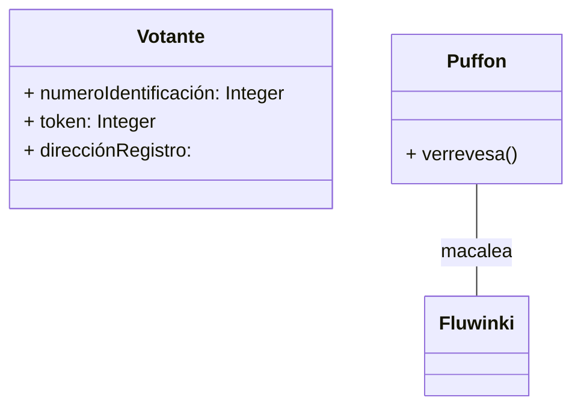

[[Tema 4-Diagramas de clases en ingeniería de requisitos]]

Sensus tiene 4 módulos:

+ Registrar: 
+ Pollster
+ Validator
+ Tallier: cuenta votos

Antes de registrarse el votante lanza un proceso para obtener el número de identificación, token y dirección de registro de los administradores. Se puede iniciar el registro con el módulo pollster usando el comando sensus.

