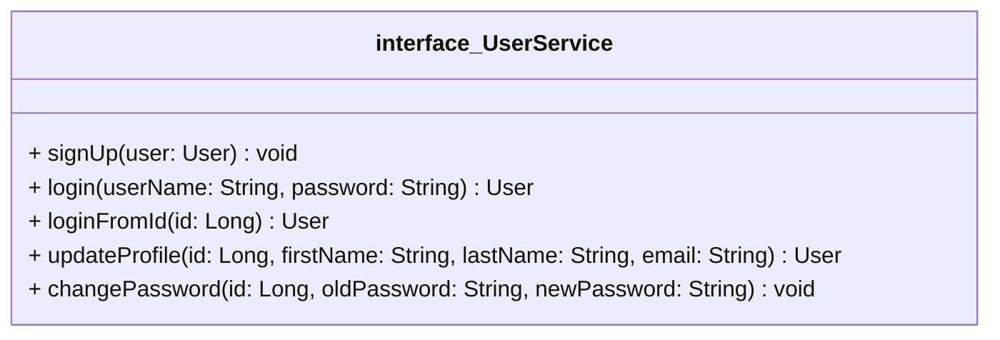
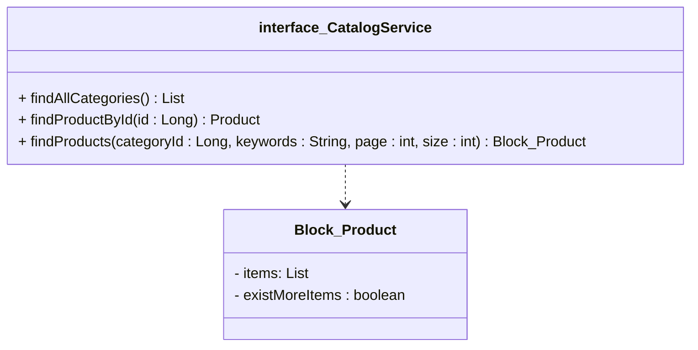
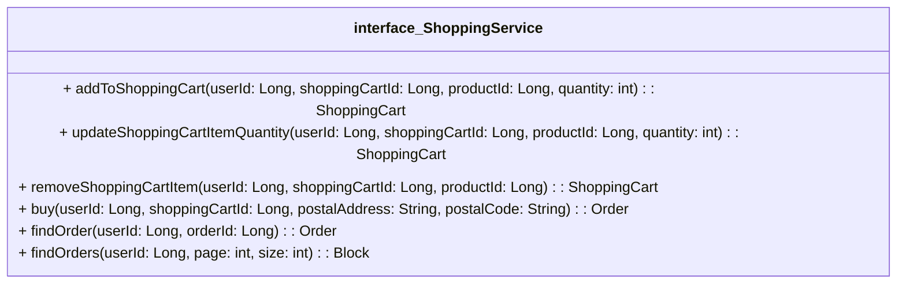

[[Tema 3-Capa lógica de negocio con Spring]]

# 1.Casos de uso
PA Shop ofrece 14 casos de uso, agrupados en 3 fachadas:
+ [>]  *UserService:* registro de usuarios.
+ [>] *CatalogService:* búsqueda de productos.
+ [>] *ShoppingService:* gestión del carrito, compra y pedidos.

$\space$
La implementación de estos servicios utiliza un servicio interno llamado `PermissionChecker`. Permite verificar los permisos de acceso, por ejemplo, de un usuario a un carrito.

