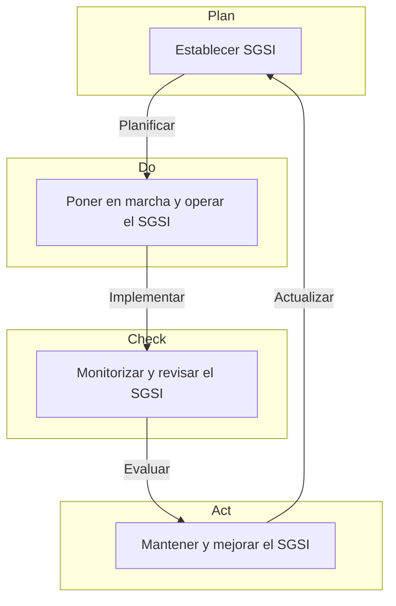

 [[Tema 11-Gestión de la seguridad]]

## Normas ISO en TI
+ **Normas 20000:** requisitos para un sistema de gestión de servicios de TI.
+ **Normas 27000:** requisitos para implementar y mantener un Sistema de Gestión de la Seguridad de la Información (SGSI).

También hay ISO de gestión de riesgos en seguridad informática., como la 27005. Algunas herramientas de análisis de riesgos son:
+ Pilar
+ Secitor

### Regla 27002
Es un código de buenas prácticas. Es una guía para saber qué mejorar en la seguridad de la información de la organización.

Establece la base común para desarrollar normas de seguridad dentro de las organizaciones. Define diferentes dominios de control que cubren ampliamente la Gestión de la Seguridad de la Información. 

### Regla 27001
Es una norma de gestión, certificable. El objetivo es que la organización sea capaz de priorizar y seleccionar controles en base a sus posibilidades y necesidades/riesgos de información.

Define un marco para el establecimiento de objetivos y establece las directrices y principios de acción en lo referente a seguridad de la información. Tiene en cuenta requisitos legales, de negocio y contractuales. 

Se alinea el contexto estratégico de gestión del riesgo de la organización en el que se desarrolla el SGSI. Permite establecer los criterios de evaluación del riesgo.

Sigue una metodología Plan-Do-Act-Check:

