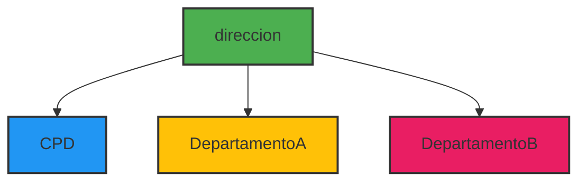
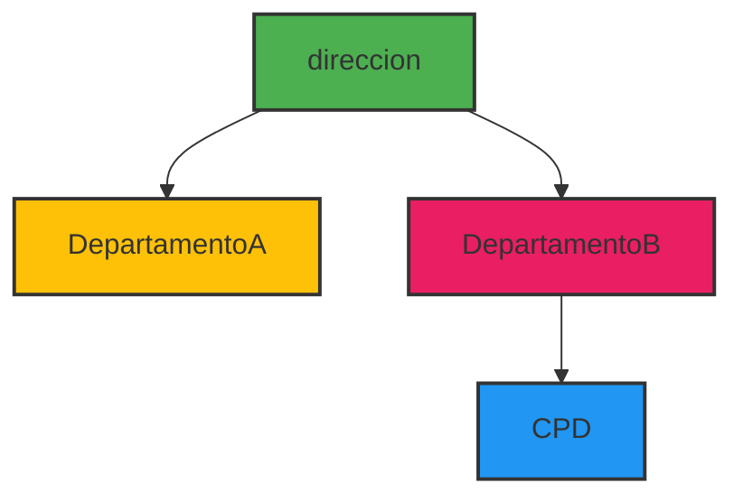
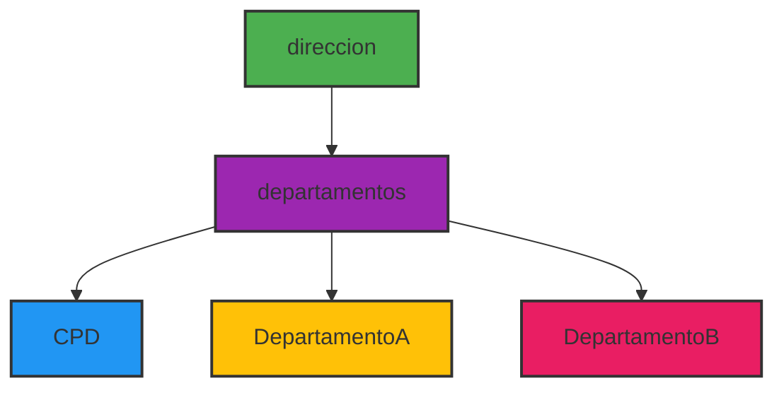

[[Tema 8-Organización de un CPD]]

## Selección de la ubicación de un CPD
La forma de integración más adecuada del CPD en la jerarquía organizativa depende en gran medida de la estructura de la organización, pero en general, y debido a la importancia estratégica de este departamento, es recomendable que se integre como staff dependiendo directamente de la dirección. Esta configuración le confiere el peso y relevancia que le corresponde.

El CPD lleva a cabo mejor la consecución de sus objetivos cuando engloba todas las funciones

## CPD centralizado
### Dependiente de la dirección

### Dependiente de un departamento

### Independiente

## Descentralizado
Se ubica físicamente en diferentes puntos de la organización. En muchas organizaciones, el CPD no existe como tal; está constituido por diferentes secciones asignadas a cada uno de los diferentes departamentos, según sus propias necesidades.

